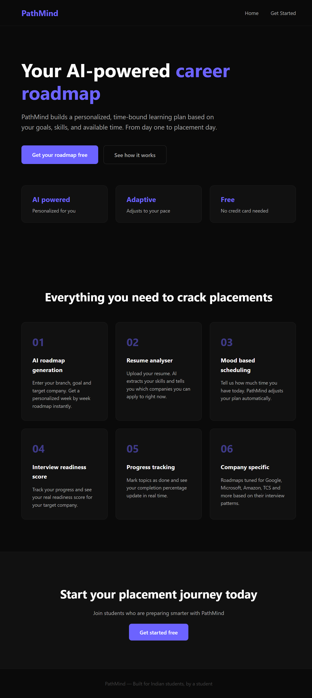
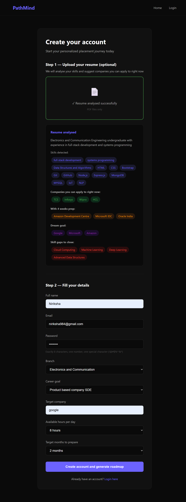
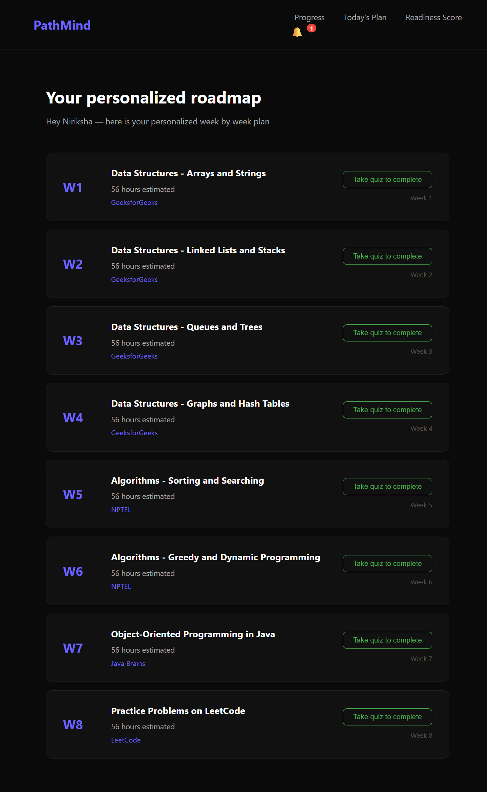
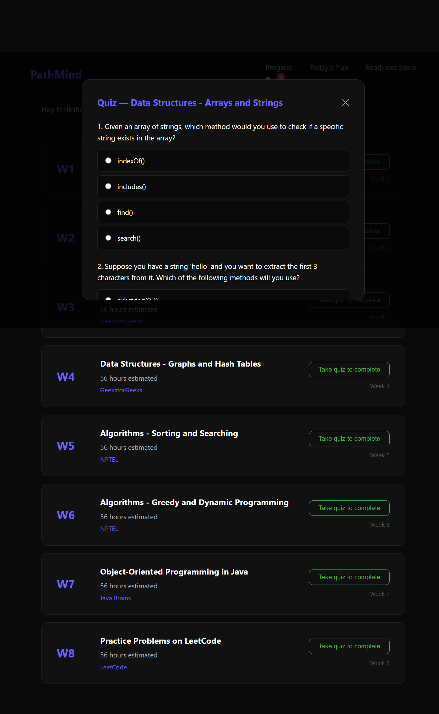
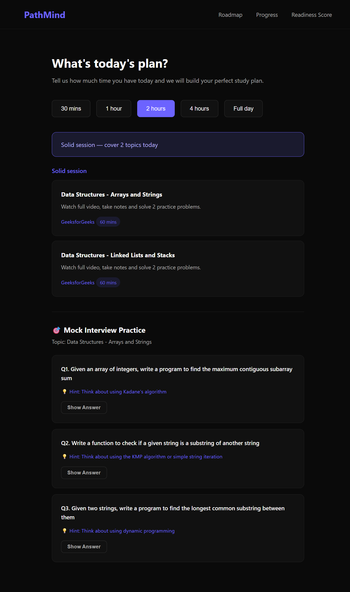
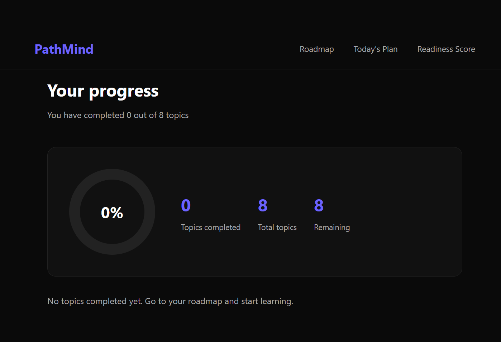
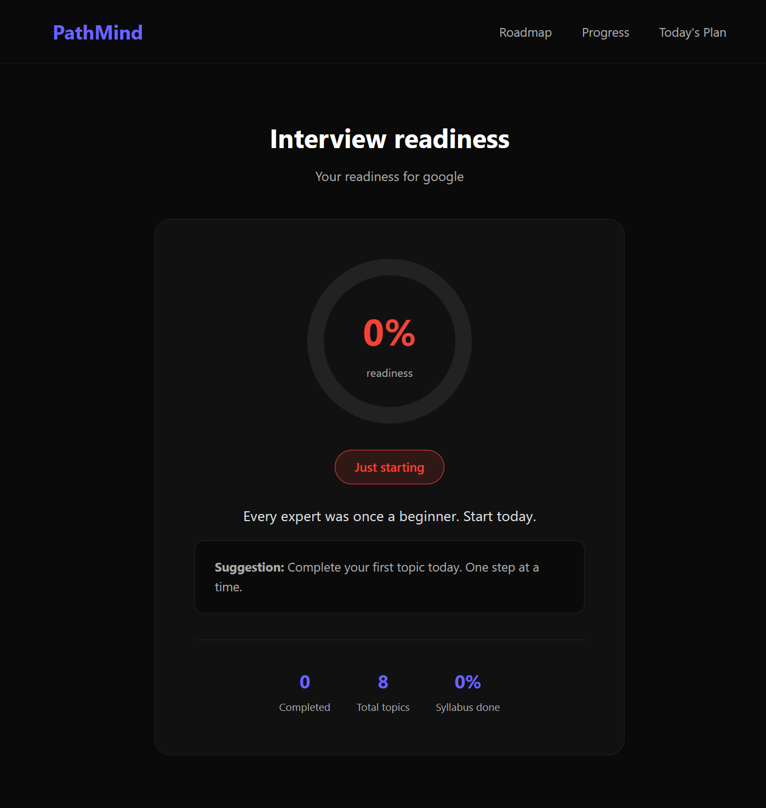

# PathMind — AI-Powered Career Roadmap

**Live Demo:** [pathmind.netlify.app](https://pathmind.netlify.app)

---

I built this because I was confused about placements myself.

Everyone around me was watching random YouTube videos, following generic roadmaps from Reddit, and still not knowing if they were actually ready for interviews. I was doing the same thing. So I decided to build something that actually helps.

PathMind is an AI-powered platform that takes your branch, goal, target company and available time — and builds a personalized week by week learning roadmap just for you. Not a generic list. Your roadmap, based on your situation.

---

## Screenshots









---

## What it does

**Resume analyser** — Upload your resume and PathMind tells you which companies you can apply to right now, which ones you can reach in 4 weeks, and what skills you still need to build.

**AI roadmap generation** — Enter your branch, goal, target company and available hours. Get a personalized week by week roadmap generated by Groq AI (LLaMA 3.3 70b).

**Quiz before completion** — You cannot mark a topic as done by just clicking a button. You must pass a 3 question AI generated quiz first. 2 out of 3 correct to pass.

**Mood based scheduling** — Tell PathMind how much time you have today — 30 mins, 1 hour, 2 hours, or a full day. It gives you a structured study plan accordingly. Full day plans include morning, afternoon and evening sessions with break reminders.

**Mock interview questions** — After your daily study plan, get 3 real interview questions on your current topic with hints and answers. Practice like a real interview every day.

**Progress tracking** — Mark topics done (after passing the quiz), see your completion percentage update live.

**Interview readiness score** — Live score calibrated to your target company's difficulty. Getting into Google needs more than 60% completion — the score accounts for that.

**In-app notifications** — Daily streak alerts, peer comparison based on real PathMind user data, milestone celebrations, and schedule reminders.

**JWT authentication** — Secure signup and login with bcrypt password hashing and JWT tokens. Password must be exactly 8 characters with at least one number and one special character.

---

## Tech stack

| Layer | Technology |
|-------|-----------|
| Frontend | HTML, CSS, JavaScript |
| Backend | Node.js, Express |
| Database | MySQL (Railway cloud) |
| AI | Groq API — LLaMA 3.3 70b (free) |
| Auth | JWT + bcryptjs |
| File upload | Multer + pdfreader |
| Deployment | Netlify (frontend) + Render (backend) |

---

## API endpoints

| Method | Endpoint | Description |
|--------|----------|-------------|
| POST | /api/auth/signup | Create account with JWT |
| POST | /api/auth/login | Login and get JWT token |
| POST | /api/roadmap/generate | Generate AI roadmap via Groq |
| POST | /api/resume/analyse | Analyse resume PDF, extract skills |
| POST | /api/progress/mark | Mark topic as done |
| GET | /api/progress/:user_id | Get completion percentage |
| POST | /api/schedule/today | Get mood based daily plan |
| GET | /api/readiness/:user_id | Get interview readiness score |
| POST | /api/quiz/generate | Generate MCQ quiz for a topic |
| POST | /api/quiz/submit | Submit quiz answers, mark complete if passed |
| POST | /api/quiz/mock | Get 3 mock interview questions |
| GET | /api/notifications/:user_id | Get personalized notifications |

---

## How to run locally

Clone the repo:

```bash
git clone https://github.com/Niriksha-2005/Pathmind.git
cd Pathmind/backend
npm install
```

Create a `.env` file inside the backend folder:

```
PORT=5000
DB_HOST=your_mysql_host
DB_USER=root
DB_PASSWORD=your_password
DB_NAME=pathmind
DB_PORT=3306
GROQ_API_KEY=your_groq_key
JWT_SECRET=your_jwt_secret
```

Create the database in MySQL:

```sql
CREATE DATABASE pathmind;
USE pathmind;

CREATE TABLE users (
  id INT AUTO_INCREMENT PRIMARY KEY,
  name VARCHAR(100) NOT NULL,
  email VARCHAR(100) UNIQUE NOT NULL,
  password VARCHAR(255),
  branch VARCHAR(100),
  goal VARCHAR(200),
  target_company VARCHAR(100),
  hours_per_day INT,
  target_months INT,
  created_at TIMESTAMP DEFAULT CURRENT_TIMESTAMP
);

CREATE TABLE roadmaps (
  id INT AUTO_INCREMENT PRIMARY KEY,
  user_id INT NOT NULL,
  topics JSON NOT NULL,
  total_weeks INT,
  created_at TIMESTAMP DEFAULT CURRENT_TIMESTAMP,
  FOREIGN KEY (user_id) REFERENCES users(id)
);

CREATE TABLE progress (
  id INT AUTO_INCREMENT PRIMARY KEY,
  user_id INT NOT NULL,
  topic_name VARCHAR(200) NOT NULL,
  status ENUM('pending', 'in_progress', 'completed') DEFAULT 'pending',
  completed_at TIMESTAMP,
  FOREIGN KEY (user_id) REFERENCES users(id)
);
```

Start the server:

```bash
node server.js
```

Open `frontend/index.html` with Live Server in VS Code.

---

## Project structure
Pathmind/
├── backend/
│   ├── config/
│   │   └── db.js
│   ├── controllers/
│   │   ├── authController.js
│   │   ├── userController.js
│   │   ├── roadmapController.js
│   │   ├── progressController.js
│   │   ├── scheduleController.js
│   │   ├── readinessController.js
│   │   ├── resumeController.js
│   │   ├── quizController.js
│   │   └── notificationController.js
│   ├── middleware/
│   │   └── authMiddleware.js
│   ├── routes/
│   │   ├── authRoutes.js
│   │   ├── userRoutes.js
│   │   ├── roadmapRoutes.js
│   │   ├── progressRoutes.js
│   │   ├── scheduleRoutes.js
│   │   ├── readinessRoutes.js
│   │   ├── resumeRoutes.js
│   │   ├── quizRoutes.js
│   │   └── notificationRoutes.js
│   └── server.js
└── frontend/
├── css/
│   └── style.css
├── js/
│   ├── signup.js
│   ├── login.js
│   ├── roadmap.js
│   ├── progress.js
│   ├── schedule.js
│   ├── readiness.js
│   └── notifications.js
├── index.html
├── signup.html
├── login.html
├── roadmap.html
├── progress.html
├── schedule.html
└── readiness.html


---

## Planned improvements

- Web Push notifications — alerts even when browser is closed
- Dark and light mode toggle
- Community roadmaps — students can publish and clone roadmaps
- Weekly email summary
- Adaptive timeline — roadmap recalculates automatically based on actual pace
- Redis caching for frequently accessed roadmaps

---

## About

I'm Niriksha Shetty, a 6th semester Electronics and Communication Engineering student from Bengaluru. I built PathMind as a placement portfolio project but also because I genuinely needed something like this myself.

If you're a student preparing for placements — [try it here](https://pathmind.netlify.app).